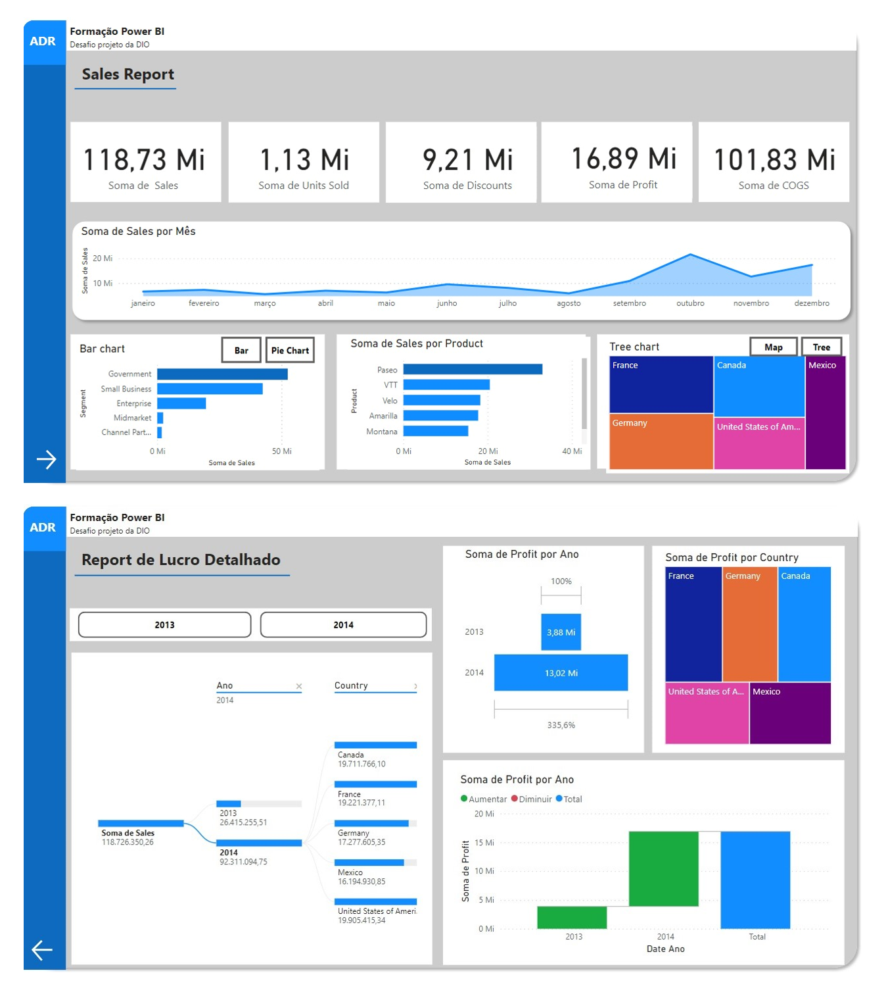

# Desafio Criando um Relatório de Vendas Elegante com Power BI
## Resultado


# Desafio Processando e Transformando Dados com Power BI
## 

### Criar Banco de Dados
```
CREATE DATABASE azure_company
```

### Criar Tabelas
```
USE azure_company

-- Create employee table
CREATE TABLE employee (
    Fname VARCHAR(15) NOT NULL,
    Minit CHAR,
    Lname VARCHAR(15) NOT NULL,
    Ssn CHAR(9) NOT NULL,
    Bdate DATE,
    Address VARCHAR(30),
    Sex CHAR,
    Salary DECIMAL(10, 2),
    Super_ssn CHAR(9),
    Dno INT NOT NULL,
    CONSTRAINT chk_salary_employee CHECK (Salary > 2000.0),
    CONSTRAINT pk_employee PRIMARY KEY (Ssn)
);

-- Create department table
CREATE TABLE department (
    Dname VARCHAR(15) NOT NULL,
    Dnumber INT NOT NULL,
    Mgr_ssn CHAR(9) NOT NULL,
    Mgr_start_date DATE,
    Dept_create_date DATE,
    CONSTRAINT chk_date_dept CHECK (Dept_create_date < Mgr_start_date),
    CONSTRAINT pk_dept PRIMARY KEY (Dnumber),
    CONSTRAINT unique_name_dept UNIQUE (Dname),
    FOREIGN KEY (Mgr_ssn) REFERENCES employee (Ssn)
);

-- Create dept_locations table
CREATE TABLE dept_locations (
    Dnumber INT NOT NULL,
    Dlocation VARCHAR(15) NOT NULL,
    CONSTRAINT pk_dept_locations PRIMARY KEY (Dnumber, Dlocation),
    FOREIGN KEY (Dnumber) REFERENCES department (Dnumber)
);

-- Create project table
CREATE TABLE project (
    Pname VARCHAR(15) NOT NULL,
    Pnumber INT NOT NULL,
    Plocation VARCHAR(15),
    Dnum INT NOT NULL,
    PRIMARY KEY (Pnumber),
    CONSTRAINT unique_project UNIQUE (Pname),
    FOREIGN KEY (Dnum) REFERENCES department (Dnumber)
);

-- Create works_on table
CREATE TABLE works_on (
    Essn CHAR(9) NOT NULL,
    Pno INT NOT NULL,
    Hours DECIMAL(3, 1) NOT NULL,
    PRIMARY KEY (Essn, Pno),
    FOREIGN KEY (Essn) REFERENCES employee (Ssn),
    FOREIGN KEY (Pno) REFERENCES project (Pnumber)
);

-- Create dependent table
CREATE TABLE dependent (
    Essn CHAR(9) NOT NULL,
    Dependent_name VARCHAR(15) NOT NULL,
    Sex CHAR,
    Bdate DATE,
    Relationship VARCHAR(8),
    PRIMARY KEY (Essn, Dependent_name),
    FOREIGN KEY (Essn) REFERENCES employee (Ssn)
);
```

### Inserir Dados nas Tabelas

```
use azure_company

insert into employee values ('John', 'B', 'Smith', 123456789, '1965-01-09', '731-Fondren-Houston-TX', 'M', 30000, 333445555, 5),
							('Franklin', 'T', 'Wong', 333445555, '1955-12-08', '638-Voss-Houston-TX', 'M', 40000, 888665555, 5),
                            ('Alicia', 'J', 'Zelaya', 999887777, '1968-01-19', '3321-Castle-Spring-TX', 'F', 25000, 987654321, 4),
                            ('Jennifer', 'S', 'Wallace', 987654321, '1941-06-20', '291-Berry-Bellaire-TX', 'F', 43000, 888665555, 4),
                            ('Ramesh', 'K', 'Narayan', 666884444, '1962-09-15', '975-Fire-Oak-Humble-TX', 'M', 38000, 333445555, 5),
                            ('Joyce', 'A', 'English', 453453453, '1972-07-31', '5631-Rice-Houston-TX', 'F', 25000, 333445555, 5),
                            ('Ahmad', 'V', 'Jabbar', 987987987, '1969-03-29', '980-Dallas-Houston-TX', 'M', 25000, 987654321, 4),
                            ('James', 'E', 'Borg', 888665555, '1937-11-10', '450-Stone-Houston-TX', 'M', 55000, NULL, 1);

insert into dependent values (333445555, 'Alice', 'F', '1986-04-05', 'Daughter'),
							 (333445555, 'Theodore', 'M', '1983-10-25', 'Son'),
                             (333445555, 'Joy', 'F', '1958-05-03', 'Spouse'),
                             (987654321, 'Abner', 'M', '1942-02-28', 'Spouse'),
                             (123456789, 'Michael', 'M', '1988-01-04', 'Son'),
                             (123456789, 'Alice', 'F', '1988-12-30', 'Daughter'),
                             (123456789, 'Elizabeth', 'F', '1967-05-05', 'Spouse');

insert into department values ('Research', 5, 333445555, '1988-05-22','1986-05-22'),
							   ('Administration', 4, 987654321, '1995-01-01','1994-01-01'),
                               ('Headquarters', 1, 888665555,'1981-06-19','1980-06-19');

insert into dept_locations values (1, 'Houston'),
								 (4, 'Stafford'),
                                 (5, 'Bellaire'),
                                 (5, 'Sugarland'),
                                 (5, 'Houston');

insert into project values ('ProductX', 1, 'Bellaire', 5),
						   ('ProductY', 2, 'Sugarland', 5),
						   ('ProductZ', 3, 'Houston', 5),
                           ('Computerization', 10, 'Stafford', 4),
                           ('Reorganization', 20, 'Houston', 1),
                           ('Newbenefits', 30, 'Stafford', 4)
;

insert into works_on values (123456789, 1, 32.5),
							(123456789, 2, 7.5),
                            (666884444, 3, 40.0),
                            (453453453, 1, 20.0),
                            (453453453, 2, 20.0),
                            (333445555, 2, 10.0),
                            (333445555, 3, 10.0),
                            (333445555, 10, 10.0),
                            (333445555, 20, 10.0),
                            (999887777, 30, 30.0),
                            (999887777, 10, 10.0),
                            (987987987, 10, 35.0),
                            (987987987, 30, 5.0),
                            (987654321, 30, 20.0),
                            (987654321, 20, 15.0),
                            (888665555, 20, 0.0);
